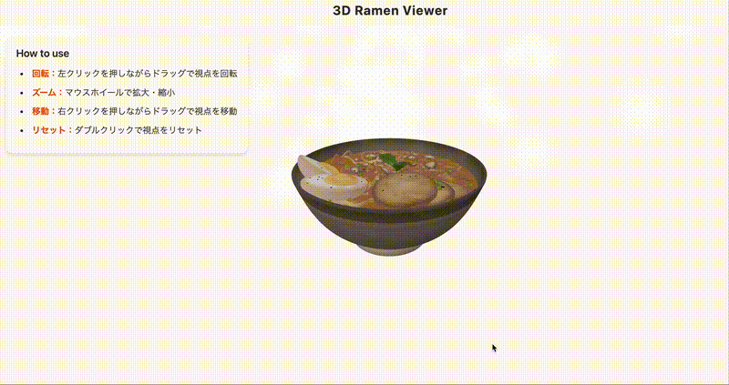

# 3D Ramen Viewer - インタラクティブなラーメン表示

## プロジェクト概要
Three.jsを使用した3Dラーメンビューワーです。美味しそうなラーメンを360度から眺めることができ、立ち上る湯気のエフェクトで臨場感を演出しています。

## デモ


操作方法やインタラクティブな表示を実際に見ることができます。

## デモ機能
- 3Dラーメンモデルの表示と自動回転
- リアルな湯気の表現（パーティクルシステム）
- マウスによるインタラクティブな視点操作
- 最適化された照明システムによる美味しそうな見た目の演出

## 操作方法
- **回転**: 左クリックを押しながらドラッグで視点を回転
- **ズーム**: マウスホイールで拡大・縮小
- **移動**: 右クリックを押しながらドラッグで視点を移動
- **リセット**: ダブルクリックで視点をリセット

## 技術スタック
- Three.js (3Dグラフィックス)
- Vite (開発環境)
- JavaScript (ES6+)

## セットアップと開発方法

```bash
# 依存関係のインストール
npm install

# 開発サーバーの起動
npm run dev

# ビルド
npm run build
```

## プロジェクト構造

```
プロジェクトルート/
  ├── src/
  │   ├── main.js          # メインの3D実装（シーン設定、湯気エフェクト等）
  │   └── style.css        # スタイル定義
  │
  ├── public/
  │   └── models/          # 3Dモデルファイル
  │       └── ramen.glb    # ラーメンの3Dモデル
  │
  └── index.html           # エントリーポイント
```

## 主要機能の実装詳細

### 3Dシーン設定
- PerspectiveCamera による最適な視点設定
- OrbitControls による直感的なカメラ操作
- 複数光源による立体的な照明効果
  - 環境光による全体照明
  - スポットライトによる上からの照明
  - 前後からの補助光による立体感の強調

### 湯気エフェクト
- パーティクルシステムによるリアルな湯気表現
- 自然な上昇と渦巻き効果
- 半透明グラデーションテクスチャの活用
- パーティクルの寿命管理による継続的な演出

### パフォーマンス最適化
- アンチエイリアスの適用
- Retinaディスプレイ対応
- 効率的なパーティクル管理
- 適切なポリゴン数の維持

## 今後の展開予定
- [ ] より詳細なラーメンモデルの導入
- [ ] カスタマイズ機能（具材の選択等）
- [ ] モバイル対応の強化
- [ ] パフォーマンスの更なる最適化

## 3Dモデルについて

### 使用モデル形式
- GLB/GLTF形式を使用
- 最適化されたファイルサイズ（5MB以下）
- 適切なポリゴン数による滑らかな表示

### モデル要件
- ファイルタイプ: `.glb`（推奨）
- ポリゴン数: 10万以下
- テクスチャ解像度: 2048x2048以下
- アニメーション: 不要

## ライセンス
MIT

## 謝辞
このプロジェクトは以下のライブラリとツールに支えられています：
- Three.js
- Vite
- その他、使用している3Dモデルの作者様
https://sketchfab.com/3d-models/3d-ramen-e912b8f2da144a3fb997a3802df64806
